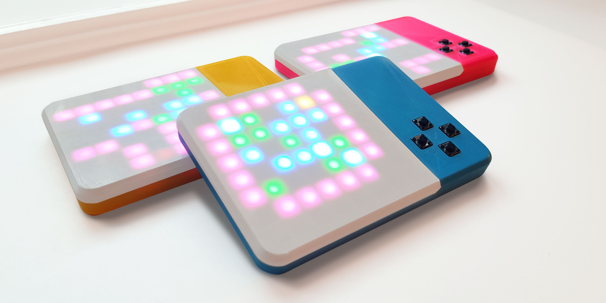

# SokoDay
This is the GitHub repository containing the 3D models and source code for the SokoDay device: https://vonkonow.com/wordpress/sokoday/

Description: SokoDay is an addictive handheld gaming device providing daily Sokoban challenges.

SokoDay downloads three new Sokoban puzzles every day from a server. One short, one medium and one long (referring to number of moves to solve the level). You can build your own device with a 3D printer, soldering iron and a handful of components. Everything is open source and hacking is encouraged!

Check out the forum where you can get support and contribute: https://vonkonow.com/wordpress/community/

For detailed building instructions visit: https://vonkonow.com/wordpress/sokoday/
